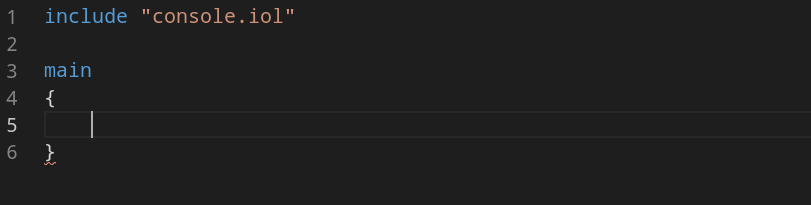
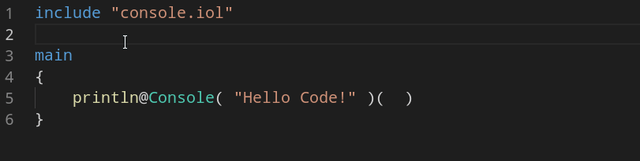

# Jolie extension for Visual Studio Code

Support for the [Jolie programming language](https://jolie-lang.org) inside of Visual Studio Code. Enjoy!

Requires the environment variable `JOLIE_HOME` to be set correctly.

## Features

- Syntax highlighting.

- Completion:

- Hover:

- Run Task

## Requirements

- [Jolie](https://jolie-lang.org) 1.8.1 or above.

## Extension Settings

- `jolie.languageServer.tcpPort`: The TCP port used by the Jolie language server.
- `jolie.languageServer.showDebugMessages`: Show debug messages from the Jolie language server in the Extensions Output Panel. The Output view is toggable under View -> Output. The channel selection is via the dropdown menu on the left.

## Known Issues

None.

## Supported Operating Systems
|            | Syntax Highlighting | Completion          | Hover               | Run Task            | 
|------------|---------------------|---------------------|---------------------|---------------------|
| Linux      |☑										 |☑										 |☑										 |	☑									 |
| MacOS      |☑										 |☑										 |☑										 |	☑									 |
| Windows    |☑										 |☑										 |☑										 |	☑									 |

## Release Notes

### 1.3.6

- Support for the new execution syntax.

### 1.3.5

- Support for Jolie minor versions with multiple digits.

### 1.3.4

- Add syntax highlighting for the class keyword in foreign java blocks.

### 1.3.3

- Update to handle the new syntax of Jolie 1.10.

### 1.3.2

- Fix a bug in file URL recognition in Windows.

### 1.3.1

- Support for syntax highlighting of shebang scripts.

### 1.2.0

- Improved support for Windows.

### 1.1.0

- Created extensions configuration parameters:
  - `Server Port`: the TCP port of the Jolie LSP Server. Default is `9123`.
  - `Show Debug Messages`: if set to true, show debug information in the output channel `Jolie LSP Client`. The Output view is toggable under View -> Output. The channel selection is via the dropdown menu on the left.
- The Jolie language Server process should be closed correctly now.
- Error message in case the Jolie LSP Server cannot start properly (includes information on how to solve the problem via extension configurations).

### 1.0.0

- Detection of the necessary Jolie version.
- Notify the user if the Jolie executable cannot be found.

### 0.9.3

First release.
